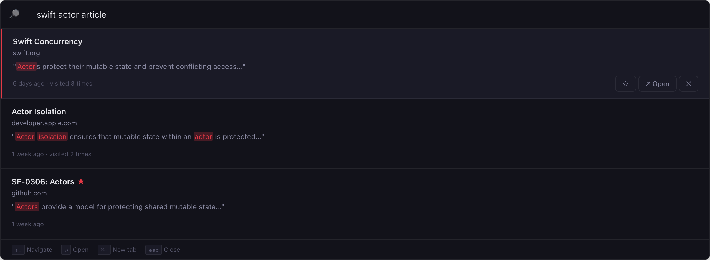
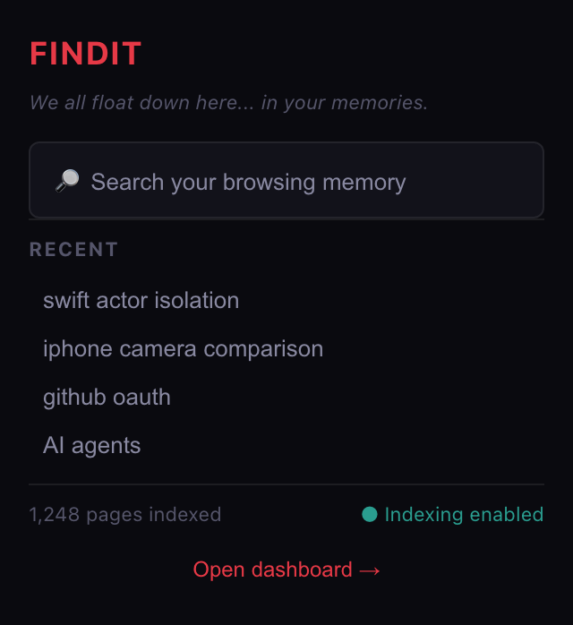
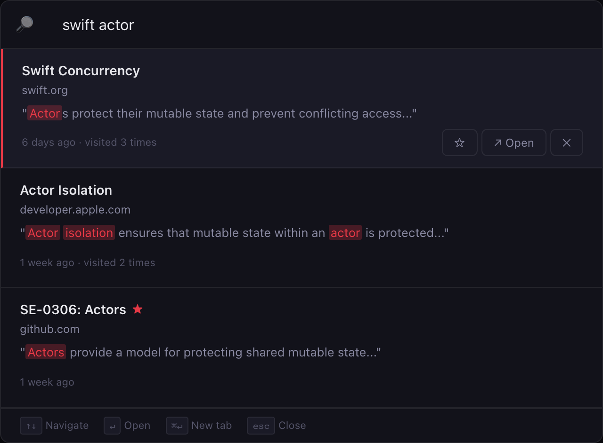
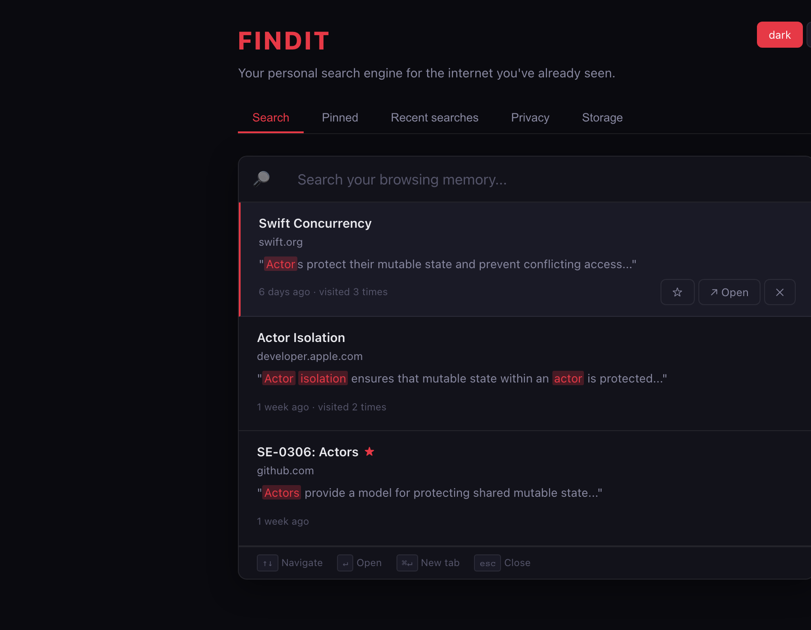

# FINDIT

[](LICENSE)

> **You don't need to remember where you saw it. FINDIT remembers for you.**

*We all float down here... in your browsing memories.*

FINDIT is a privacy-first Chrome/Brave browser extension that creates a **searchable memory of your browsing activity**. Inspired by the haunting persistence of memory from Derry's depths — but with your data staying safely on your device.

## Screenshots

### Command palette — `⌘⇧F` / `Ctrl+Shift+F`

Search your browsing memory instantly. Results show title, domain, snippets, and when you last visited.



### Toolbar popup

Quick access to search, recent queries, and indexing status.



### Search results

Full-text search with highlighted matches across everything you've visited.



### Dashboard

Manage memories, privacy settings, pinned pages, and storage from one place.



> Screenshots captured from the live extension UI. Regenerate anytime with `npm run screenshots`.

## Problem

Browser history tells you **where** you went. FINDIT helps you remember **what** you saw.

You remember seeing something online:

- "There was an article about Swift actors."
- "I saw a product comparison last week."
- "There was a GitHub repository with a particular implementation."

Normal browser history isn't good enough because it mainly searches URLs and titles. FINDIT lets you search based on **what you actually remember about the page**.

## Features

- **Local browsing search** — Full-text search across everything you've visited
- **Command palette** — `⌘⇧F` / `Ctrl+Shift+F` for instant search
- **Search snippets** — Relevant excerpts with highlighted matches
- **Time filtering** — "last week", "yesterday", "today"
- **Domain filtering** — `site:github.com swift authentication`
- **Pinned pages** — Save important pages from automatic cleanup
- **Collections** — Organize pages into Research, Work, Reading, etc.
- **Related pages** — Local text similarity between indexed pages
- **Search history** — Recent searches stored locally
- **Privacy controls** — Pause indexing, exclude domains, clear data
- **Dark/light/system themes**

## Privacy

> **Your browsing history never leaves your device.**

- No backend
- No account
- No tracking
- No analytics
- No cloud storage
- No external API calls
- IndexedDB storage only

Everything happens locally in your browser.

## Installation

FINDIT is not on the Chrome Web Store yet — install it from source. Works on **Google Chrome**, **Brave**, and other Chromium browsers.

### 1. Clone and build

```bash
git clone https://github.com/shubhransh-gupta/findit.git
cd findit
npm install
npm run generate-icons
npm run build
```

This creates a `dist/` folder with the packaged extension.

### 2. Install in Chrome

1. Open **`chrome://extensions`** in Chrome
2. Turn on **Developer mode** (top-right toggle)
3. Click **Load unpacked**
4. Select the **`dist`** folder inside the project

FINDIT appears in your toolbar. Press **`⌘⇧F`** (Mac) or **`Ctrl+Shift+F`** (Windows/Linux) to search.

### 3. Install in Brave

1. Open **`brave://extensions`** in Brave
2. Turn on **Developer mode** (top-right toggle)
3. Click **Load unpacked**
4. Select the **`dist`** folder inside the project

Same keyboard shortcut: **`⌘⇧F`** / **`Ctrl+Shift+F`**.

### Quick load (development)

To build and load in one command without the manual steps above:

```bash
npm run load          # Chrome
npm run load:brave    # Brave
```

This uses `--load-extension` and loads FINDIT for the current browser session. For a permanent install, use the **Load unpacked** steps above once.

### Development with hot reload

```bash
npm run dev
```

Then load the `dist` folder via **Load unpacked**. Vite rebuilds automatically when you change source files — reload the extension at `chrome://extensions` to pick up changes.

### Verify it works

1. Open `test-pages/swift.html` in your browser
2. Press **`⌘⇧F`** and search for `swift actors`
3. The Swift Concurrency page should appear in results

## Usage

### Command Palette

Press `⌘⇧F` (Mac) or `Ctrl+Shift+F` (Windows/Linux) to open the search interface.

```
↑ ↓     Navigate results
Enter   Open selected result
⌘ Enter Open in new tab
Esc     Close
```

### Search Syntax

Natural language search works out of the box:

```
swift actor article
iphone camera comparison
github authentication
```

Optional filters:

```
site:github.com swift concurrency
swift actors last week
"actor isolation" site:apple.com
```

### Context Menu

Right-click on any page or selection:

- **Search my browsing memory**
- **Save this page**
- **Save selected text**
- **Search similar pages** (when text is selected)

## Architecture

```
Web Page
   ↓
Content Script (extract readable content)
   ↓
Service Worker (index manager)
   ↓
IndexedDB (Dexie.js)
   ↓
Local Search Engine (tokenizer + scorer)
   ↓
FINDIT UI (command palette / popup / dashboard)
```

### Tech Stack

- TypeScript
- React 19
- Vite + @crxjs/vite-plugin
- Chrome Extension Manifest V3
- IndexedDB via Dexie.js
- Vitest for unit tests

## Project Structure

```
findit/
├── src/
│   ├── background/       Service worker, indexing pipeline
│   ├── content/          Content extraction scripts
│   ├── popup/            Toolbar popup UI
│   ├── commandPalette/   Keyboard-triggered search
│   ├── main/             Full dashboard page
│   ├── search/           Search engine, query parser, scorer
│   ├── indexing/         Page indexer, tokenizer
│   ├── database/         Dexie schema, repositories
│   ├── shared/           Types, utils, components
│   └── styles/           Global CSS
├── test-pages/           Local test HTML pages
├── tests/                Unit tests
├── website/              Marketing landing page
└── public/               Manifest, icons
```

## Testing

```bash
# Unit tests
npm test

# Test pages
Open test-pages/*.html in Chrome with the extension loaded,
then search for content from those pages in FINDIT.
```

## Permissions

| Permission | Why |
|---|---|
| `storage` | Store settings locally |
| `tabs` | Track page visits for indexing |
| `contextMenus` | Right-click FINDIT actions |
| `scripting` | Inject command palette overlay |
| `<all_urls>` | Index page content on visit |

No permissions are used for external communication. All data stays local.

## Storage Management

Access storage settings from the dashboard (`Open dashboard → Storage`):

- View indexed page count and storage usage
- Set retention policy (30 days, 90 days, 1 year, forever)
- Clear old pages or delete all data

## Website

Live marketing site: **https://shubhransh-gupta.github.io/findit/**

## License

FINDIT is released under the [MIT License](LICENSE).

[](LICENSE)

---

*FINDIT — Your personal search engine for the internet you've already seen.*

*Inspired by the memories that never fade. Built with privacy as the foundation.*
